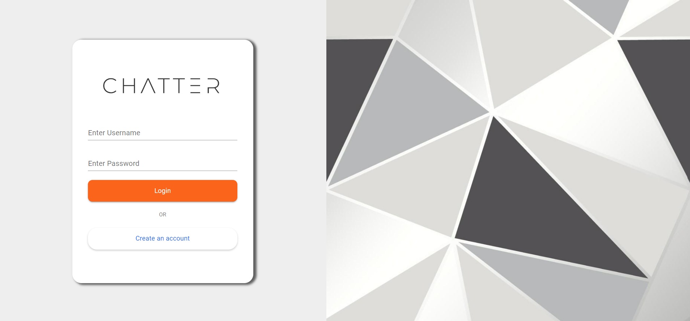
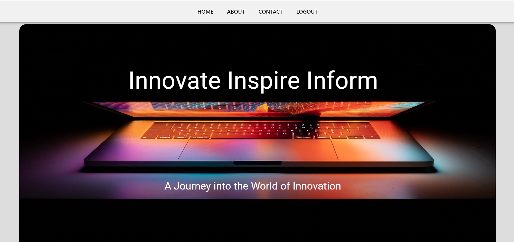
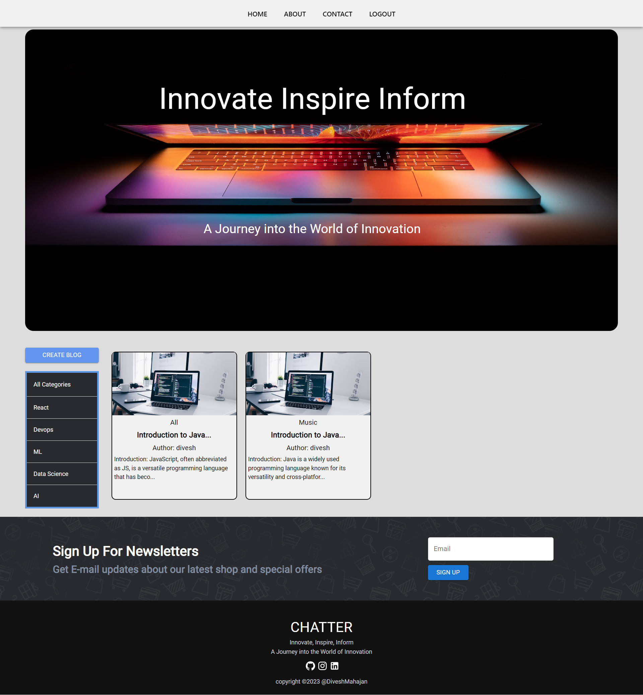

# Chatter-A-Blogging-Website

- In this project, I designed a blogging website in React.js using Axios for
  API and MongoDB Atlas for Database.
- In this website we can perform all the CRUD operations, also you can
  write blogs in different categories

 

 

 

 

 

 
